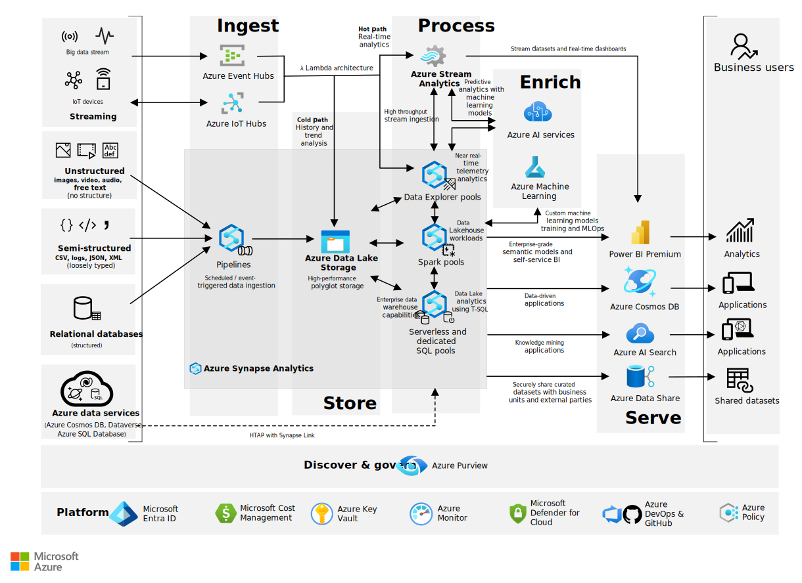

# Final Report: Modern Data Platform

## Introduction

The purpose of this report is to present an in-depth analysis and design of a modern data platform that supports scalable data ingestion, processing, and analytics. The platform aims to address the challenges faced by organizations in managing large volumes of diverse data sources while enabling real-time insights and decision-making.

## Background

### Evolution of Data Platforms

Data platforms have evolved from traditional data warehouses to modern architectures that incorporate big data technologies, cloud computing, and real-time processing capabilities. This evolution is driven by the increasing volume, velocity, and variety of data generated by businesses today.

### Key Components of Modern Data Platforms

A modern data platform typically includes the following components:

- Data ingestion layer
- Data storage and management
- Data processing and transformation
- Data analytics and visualization
- Data governance and security

## System Architecture

### Reference Architecture for Azure Modern Data Platform

The Azure modern data platform reference architecture leverages a suite of integrated Azure services designed to provide scalable, flexible, and secure data management and analytics capabilities. At the data ingestion layer, Azure Data Factory orchestrates and automates data movement from diverse sources, while Azure Event Hubs supports real-time streaming data ingestion. For data storage, Azure Data Lake Storage Gen2 offers a scalable, secure, and cost-effective repository for raw and processed data, complemented by Azure Synapse Analytics which provides a unified analytics service combining data warehousing and big data analytics.

Data processing is primarily handled by Azure Databricks, enabling collaborative Apache Spark-based analytics and machine learning workflows, along with Azure Data Factory Mapping Data Flows that provide code-free data transformation capabilities. Analytics and visualization are facilitated through Power BI for interactive dashboards and reporting, and Azure Synapse Serverless SQL Pools which allow on-demand querying of data stored in the lake without infrastructure management.

Additionally, AI and machine learning integration is supported via Azure Cognitive Services, offering pre-built AI models for vision, speech, and language, and Azure Machine Learning which provides a comprehensive platform for building, training, and deploying custom ML models. Together, these services form a cohesive architecture that supports end-to-end data ingestion, storage, processing, and advanced analytics, enabling organizations to scale their data platforms efficiently while maintaining flexibility and accelerating insights.

### Overview

The proposed modern data platform architecture integrates batch and streaming data processing, leveraging cloud-native services to ensure scalability and flexibility.

[Analytics end-to-end with Azure Synapse](https://learn.microsoft.com/en-us/azure/architecture/example-scenario/dataplate2e/data-platform-end-to-end)

### Data Ingestion

Data ingestion supports multiple sources including databases, IoT devices, and external APIs. The system uses Apache Kafka for real-time streaming and Apache NiFi for batch ingestion.

### Data Storage

Data is stored in a data lake built on cloud object storage, complemented by a data warehouse for structured analytics. The storage layer supports schema evolution and data versioning.

### Data Processing

Processing is handled through Apache Spark for batch jobs and Apache Flink for streaming analytics. These frameworks enable complex transformations and machine learning workflows.

### Analytics and Visualization

The platform supports SQL-based querying via Presto and integrates with BI tools such as Tableau and Power BI for data visualization.

### Security and Governance

Role-based access control, data encryption, and audit logging are implemented to ensure data security and compliance with regulations.

## Implementation Details

### Technology Stack

| Component           | Technology (Azure)                                                                 |
|---------------------|-------------------------------------------------------------------------------------|
| Data Ingestion      | Azure Data Factory (pipelines), Azure Event Hubs, Azure IoT Hub, Azure Logic Apps  |
| Data Storage        | Azure Data Lake Storage Gen2 (ADLS Gen2), Azure Synapse Analytics (Dedicated SQL), Azure SQL Database |
| Data Processing     | Azure Databricks (Spark), Synapse Spark Pools, ADF Mapping Data Flows, Azure Stream Analytics |
| Query Engine        | Azure Synapse SQL (Serverless & Dedicated), Azure Data Explorer (optional)         |
| Visualization       | Microsoft Power BI                                                                  |
| Security            | Microsoft Entra ID (Azure AD), Azure Key Vault, Azure RBAC/Private Link, Microsoft Defender for Cloud, Microsoft Purview (governance) |

### Deployment

The platform is deployed on **Microsoft Azure**, leveraging **Azure Kubernetes Service (AKS)** for container orchestration, integrated with **Azure DevOps** to enable continuous integration and continuous delivery (CI/CD) pipelines.

## Use Cases

### Real-Time Fraud Detection

Streaming data from transaction systems is analyzed in real-time to identify fraudulent activities using machine learning models.

### Customer 360 View

Aggregating data from multiple sources to create a comprehensive profile of customers for personalized marketing.

### Predictive Maintenance

IoT sensor data is processed to predict equipment failures and schedule maintenance proactively.

## Challenges and Solutions

| Challenge                        | Solution                                  |
|---------------------------------|-------------------------------------------|
| Data Silos                      | Implemented unified data lake architecture |
| Scalability                    | Adopted cloud-native scalable services    |
| Data Quality                   | Established data validation pipelines     |
| Security Compliance            | Enforced strict access controls and auditing |

## Conclusion

The modern data platform designed and implemented offers a robust, scalable, and secure environment for managing and analyzing large volumes of data. By leveraging cloud-native technologies and best practices, the platform addresses key business needs and supports advanced analytics capabilities.

## References

1. Stonebraker, M., et al. (2018). The Architecture of Modern Data Platforms. *Communications of the ACM*, 61(9), 50-59.
2. Kreps, J. (2014). Questioning the Lambda Architecture. *O'Reilly Strata Conference*.
3. AWS Documentation: Building Data Lakes on AWS. (2023). Retrieved from https://aws.amazon.com/data-lakes/

## Appendices

### Appendix A: Glossary

- **Data Lake:** A centralized repository that allows storage of structured and unstructured data at any scale.
- **Streaming Analytics:** The processing and analysis of data in real-time as it is ingested.
- **Schema Evolution:** The capability to manage changes in data schema without disrupting existing processes.

### Appendix B: Diagram Details

The architecture diagram illustrates the flow of data from ingestion through processing to analytics, highlighting key components and their interactions.
