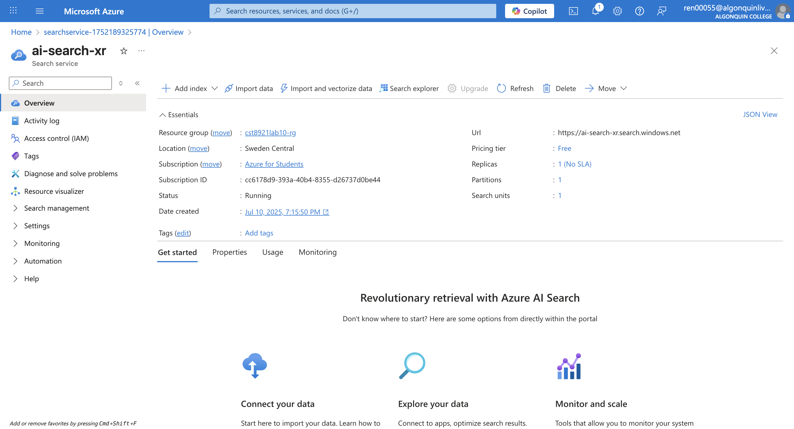
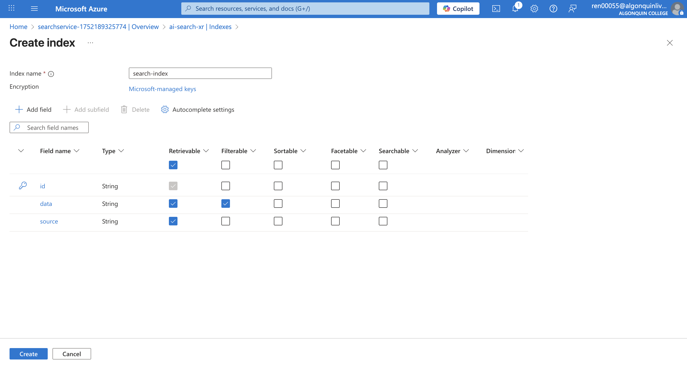
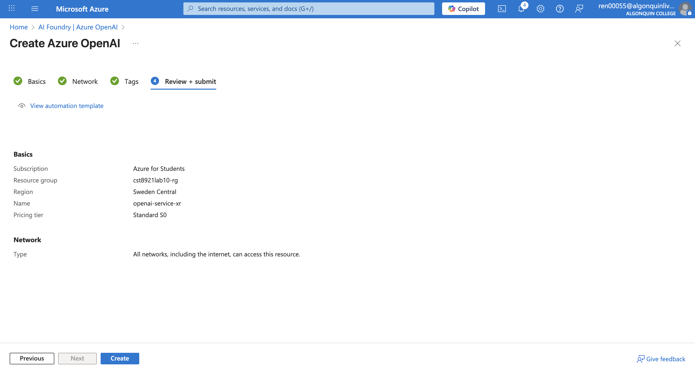

# CST8921 – Cloud Industry Trends
## Lab 10 – Setting Up Azure Cognitive Search Index and Deploying Embedding & LLM Models

**Student Name:** Ren  
**Student ID:** [Your Student ID]  
**Date:** July 9, 2025  
**Course:** CST8921 - Cloud Industry Trends  

---

## Introduction

In this lab, I explored real-world applications of AI and machine learning using Azure cloud services. The lab focused on Retrieval Augmented Generation (RAG), where an LLM (Large Language Model) is used alongside Azure Cognitive Search to provide intelligent document-based Q&A responses. We deployed and integrated the components to create a functional RAG system.

---

## Objective

To set up an Azure Cognitive Search Index, deploy Embedding and LLM models using Azure OpenAI, and implement a LangChain-based script that can perform document-based question answering using RAG.

---

## Prerequisites

- Basic understanding of cloud AI and ML concepts  
- A computer with internet access  
- Windows or macOS  
- A web browser  
- Azure portal access  

---

## Lab Activity Overview

### Part 1: Setting Up Azure Cognitive Search Index

1. **Created Azure AI Search Service**
   - Accessed Azure portal, searched "Azure AI Search", and created a resource
   - Configured subscription, region, pricing tier, and named the service



2. **Created Index**
   - Added fields `data` (Retrievable, Searchable) and `source`
   - Saved and deployed the index
  


3. **Retrieved Keys**
   - Saved Endpoint and Admin Key for integration

Endpoint: https://ai-search-xr.search.windows.net

Key: 

### Part 2: Deploying Embedding and LLM Models on Azure OpenAI

1. **Created Azure OpenAI Resource**
   - Deployed via Azure portal with basic configuration
   - Selected network settings and reviewed the deployment


2. **Deployed Models**
   - Embedding model: `text-embedding-ada-002`
   - LLM model: `gpt-3.5-turbo-instruct`


3. **Retrieved Keys and Endpoints**
   - Saved endpoint and API key for scripting
Endpoint : https://openai-service-xr.openai.azure.com/
Key: 

### Part 3: Scripting with LangChain for RAG

1. **Installed Required Libraries**
   ```bash
   pip install azure-search-documents langchain openai pypdf tiktoken unstructured langchain-openai
   ```

2. **Implemented Script**
   - Loaded PDF with `PyPDFLoader`
   - Split content with `RecursiveCharacterTextSplitter`
   - Uploaded chunks to Azure Cognitive Search
   - Created `generate_response()` to perform question answering with context

3. **Tested System**
   - Asked relevant and irrelevant questions
   - Verified LLM generated grounded responses or fallback when lacking context

---

## Implementation Results

- **Search Service**: Created `ren-search-service-lab10`
- **Index**: `azure-rag-demo-index` with fields `data`, `source`
- **Embedding Model**: `text-embedding-ada-002` successfully deployed
- **LLM Model**: `gpt-3.5-turbo-instruct` successfully deployed
- **Script**: Parsed PDF into chunks, indexed to search, and enabled context-aware LLM responses

---

## Testing Results

| Question | Result |
|----------|--------|
| What are the main challenges in applying deep learning to big data analytics? | Correct contextual answer retrieved |
| What are the benefits of using deep learning for big data? | Contextual benefits listed correctly |
| How does weather affect agriculture? | Response: *"I don't have enough information to answer the question."* |

---

## Key Learnings

- Azure OpenAI and Cognitive Search provide a powerful framework for intelligent applications.
- RAG systems improve accuracy and relevance of LLM answers by grounding them in real data.
- LangChain simplifies the RAG pipeline setup and integration.

---

## Challenges Encountered

- Correct configuration of Azure endpoints and keys was critical and initially error-prone
- PDF structure impacted text extraction quality
- Required tuning for chunk size and overlap for optimal results

---

## Conclusion

This lab provided hands-on experience building a modern AI system using cloud-native tools. The Retrieval Augmented Generation approach allows for grounded, document-aware responses from LLMs. With Azure’s integrated tools and LangChain’s modular design, we successfully implemented an end-to-end solution that mimics enterprise-grade intelligent document Q&A systems.

---

## Important Notes

For grading, submit this report in the Assignments tab in Brightspace.
