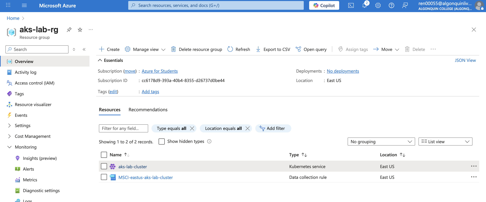
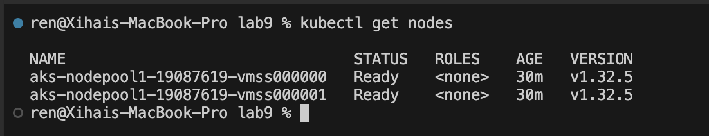
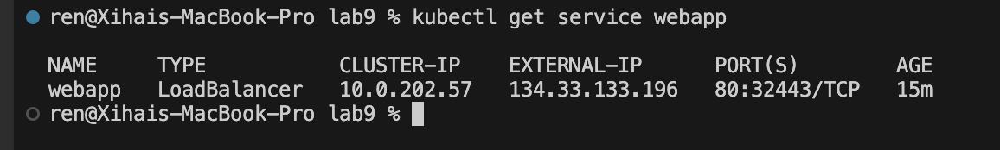
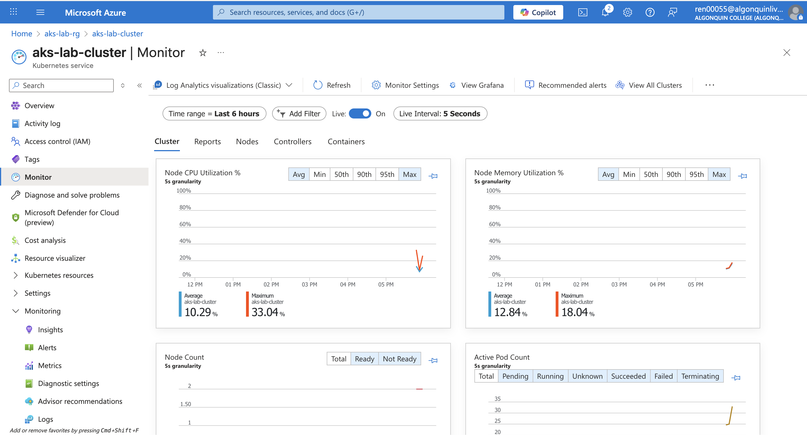
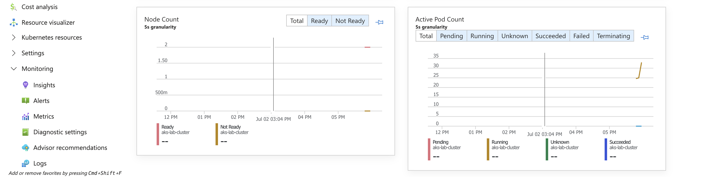
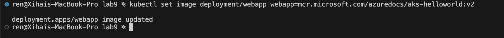
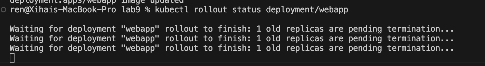
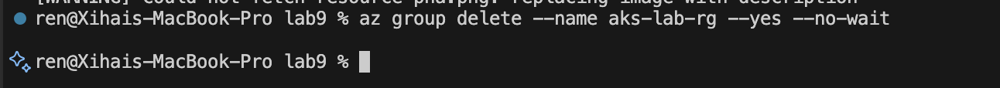

# Lab 9 Report – AKS Cluster Deployment and Management

**Student Name**: Xihai Ren  
**Course**: CST8921 – Cloud Industry Trends
**Date**: July 2, 2025


## Objective

The objective of this lab was to deploy and manage a sample web application on Azure Kubernetes Service (AKS). This included creating a Kubernetes cluster, deploying an app, enabling autoscaling, monitoring the cluster, performing a rolling update, and cleaning up resources.


## Steps and Observations

### 1. Create an AKS Cluster

Commands used:
```bash
az group create --name aks-lab-rg --location eastus
az aks create \
  --resource-group aks-lab-rg \
  --name aks-lab-cluster \
  --node-count 2 \
  --enable-addons monitoring \
  --generate-ssh-keys
```
- Successfully created the resource group and AKS cluster with monitoring enabled.
  



### 2. Connect to the Cluster

Commands used:
```bash
az aks get-credentials --resource-group aks-lab-rg --name aks-lab-cluster
kubectl get nodes
```
- Verified access to the cluster and confirmed two nodes were ready.



### 3. Deploy a Sample App

Created the following `deployment.yaml`:
```yaml
apiVersion: apps/v1
kind: Deployment
metadata:
  name: webapp
spec:
  replicas: 2
  selector:
    matchLabels:
      app: webapp
  template:
    metadata:
      labels:
        app: webapp
    spec:
      containers:
      - name: webapp
        image: mcr.microsoft.com/aks/periscope:0.0.12
        ports:
        - containerPort: 80
```


Deployment commands:
```bash
kubectl apply -f deployment.yaml
kubectl expose deployment webapp --type=LoadBalancer --port=80
kubectl get service webapp
```
- App was successfully deployed and exposed with a public IP.




### 4. Enable Horizontal Pod Autoscaler

Commands used:
```bash
kubectl autoscale deployment webapp --cpu-percent=50 --min=2 --max=5
kubectl get hpa
```
- Autoscaler created and targeting CPU at 50%.


### 5. Monitor the Cluster

- Enabled Container Insights through Azure Portal.
- Observed metrics and logs in real time using Azure Monitor.







### 6. Perform a Rolling Update

Command used:
```bash
kubectl set image deployment/webapp webapp=mcr.microsoft.com/aks/periscope:0.0.13
kubectl rollout status deployment/webapp
```
- Web app image updated with no downtime using rolling update strategy.
  






### 7. Clean Up Resources

Command used:
```bash
az group delete --name aks-lab-rg --yes --no-wait
```
- Deleted the resource group to avoid incurring further costs.




## Conclusion

This lab provided hands-on experience with deploying and managing applications on AKS. Key takeaways included provisioning clusters, deploying workloads, configuring autoscaling, monitoring performance, and using rolling updates—all critical skills for real-world cloud-native application management.
